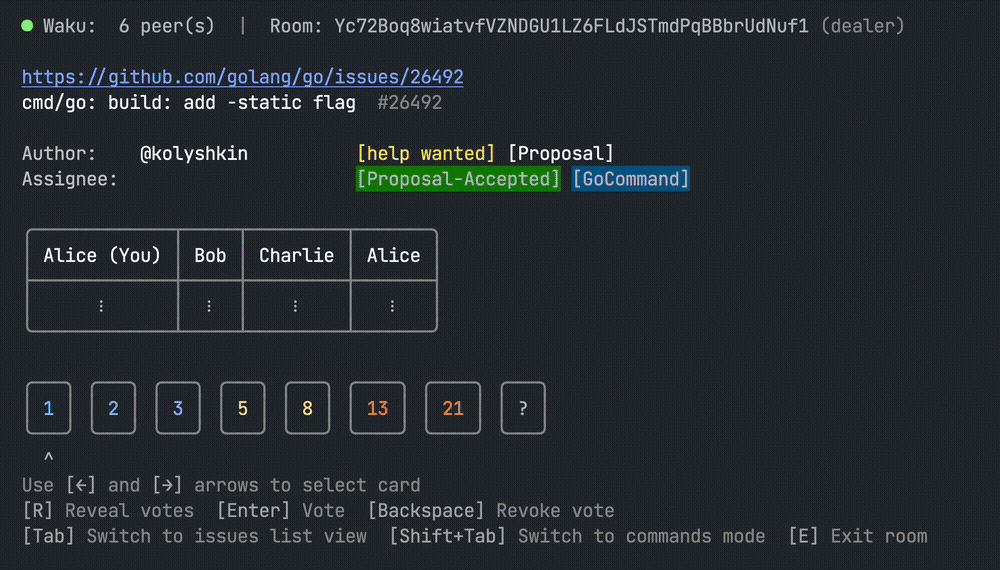

[](https://codeclimate.com/github/six78/2-story-points-cli/maintainability)
[](https://codeclimate.com/github/six78/2-story-points-cli/test_coverage)
[](https://goreportcard.com/report/github.com/six78/2-story-points-cli)
[](https://app.fossa.com/projects/git%2Bgithub.com%2Fsix78%2F2-story-points-cli?ref=badge_shield)

# Lock, Stock and Two Story Points

Decentralized. Poker planning. In terminal.

<!-- 765px = 3/8 of 2040 (width of the original gif) for better rendering -->
<p align="left">
  
</p>

[//]: # (Fancy a web version? -> https://six78.github.io/2-story-points )

# Description

- This is a CLI app for poker planning
- We use [Waku](https://waku.org) for decantralized players communication
- Messages are end-to-end encrypted, the key is shared elsewhere as part of the room id

# Build it your own
 ```shell
 git clone https://github.com/six78/2-story-points-cli.git
 cd 2-story-points
 make build
 ./2sp
 ```
 
Or just run the code with a shadow build:

```shell
make run
```

Now share your room id with friends and start estimating your issues!

# Protocol

Description of the protocol can be found [here](docs/PROTOCOL.md).


## License
[](https://app.fossa.com/projects/git%2Bgithub.com%2Fsix78%2F2-story-points-cli?ref=badge_large)